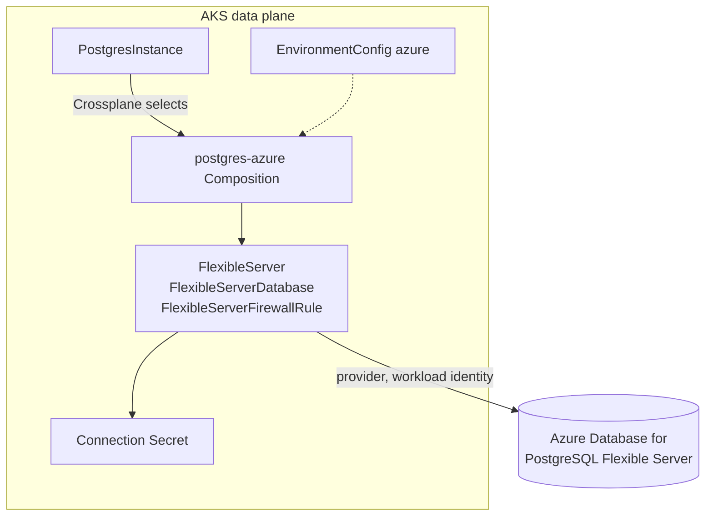

# Azure Backing

This backing builds the module's resources on Azure, using the Crossplane providers from the
[Azure provider family](https://github.com/crossplane-contrib/provider-upjet-azure). The providers
authenticate with AKS workload identity, so no cloud credential is stored in the cluster.

For how the module fits together, see the [module README](../README.md).

| Resource | Built as | Provider | Composition |
| :------- | :------- | :------- | :---------- |
| PostgreSQL | Azure Database for PostgreSQL Flexible Server | `provider-azure-dbforpostgresql` | [`postgres-composition.yaml`](postgres-composition.yaml) |

| File | What it is |
| :--- | :--------- |
| [`provider.yaml`](provider.yaml) | The providers, set up for workload identity |
| [`provider-config.yaml`](provider-config.yaml) | Which identity, tenant and subscription the providers use |
| [`environment-config.yaml`](environment-config.yaml) | This data plane's Azure settings, read by every Composition |
| `<resource>-composition.yaml` | One Composition per resource |
| `render/<resource>/` | Sample inputs for checking a Composition without a cluster |

## Prerequisites

- Steps 1 to 4 of the [module install](../README.md#install) done on this data plane
- The OpenChoreo data plane running on AKS, with the OIDC issuer and workload identity enabled
  (`az aks update --enable-oidc-issuer --enable-workload-identity`)
- An existing resource group for the resources, and permission to create a managed identity and
  assign it a role on that group
- The Azure CLI

## Install

Run these from the module's root directory, against the cluster running the OpenChoreo data plane.

### 1. Create an Azure identity for the provider

The provider acts as a user-assigned managed identity. AKS gives the provider pod a token for its
ServiceAccount, and a federated credential on the identity tells Microsoft Entra ID to accept that
token in exchange for the identity.

```bash
RESOURCE_GROUP=<resource group for the resources>
AKS_RESOURCE_GROUP=<resource group of the AKS cluster>
AKS_CLUSTER=<AKS cluster name>
IDENTITY=id-crossplane

az identity create -g "$RESOURCE_GROUP" -n "$IDENTITY"

az role assignment create \
  --assignee-object-id "$(az identity show -g "$RESOURCE_GROUP" -n "$IDENTITY" --query principalId -o tsv)" \
  --assignee-principal-type ServicePrincipal \
  --role Contributor \
  --scope "$(az group show -n "$RESOURCE_GROUP" --query id -o tsv)"

az identity federated-credential create \
  -g "$RESOURCE_GROUP" --identity-name "$IDENTITY" \
  --name crossplane-provider-azure-dbforpostgresql \
  --issuer "$(az aks show -g "$AKS_RESOURCE_GROUP" -n "$AKS_CLUSTER" --query oidcIssuerProfile.issuerUrl -o tsv)" \
  --subject system:serviceaccount:crossplane-system:provider-azure-dbforpostgresql \
  --audiences api://AzureADTokenExchange
```

The federated credential names one provider's ServiceAccount. Each provider in
[`provider.yaml`](provider.yaml) needs its own.

`Contributor` on the resource group lets the providers manage anything in that group, so use a group
that holds only the resources this backing creates.

### 2. Install the providers

Set the identity's client ID in [`provider.yaml`](provider.yaml), then apply it.

```bash
az identity show -g "$RESOURCE_GROUP" -n "$IDENTITY" --query clientId -o tsv

kubectl apply -f azure/provider.yaml
kubectl wait providers.pkg.crossplane.io --all --for=condition=Healthy --timeout=10m
```

Installing a provider from the family also installs `provider-family-azure`, which owns the
ProviderConfig types. Each provider's ServiceAccount name is fixed in its
`DeploymentRuntimeConfig`, so the federated credential subject from step 1 keeps matching across
provider upgrades.

> [!NOTE]
> Use the full name `providers.pkg.crossplane.io` in `kubectl` commands. AKS clusters with the Azure
> Policy add-on run Gatekeeper, which also defines a `Provider` kind, and `kubectl get providers`
> may return Gatekeeper's.

Check that AKS injected the workload identity token into the provider pod:

```bash
kubectl get pods -n crossplane-system -o name | grep provider-azure-dbforpostgresql \
  | xargs kubectl get -n crossplane-system -o jsonpath='{.spec.containers[0].env[*].name}'
```

The output should include `AZURE_CLIENT_ID` and `AZURE_FEDERATED_TOKEN_FILE`. If it does not, check
that workload identity is enabled on the cluster.

### 3. Configure the provider credentials

Set the client ID, tenant ID and subscription ID in [`provider-config.yaml`](provider-config.yaml),
then apply it.

```bash
kubectl apply -f azure/provider-config.yaml
```

Azure resources in any namespace use the `ClusterProviderConfig` named `default` unless they say
otherwise, so this one object covers every cell namespace.

### 4. Configure this data plane's settings

Edit [`environment-config.yaml`](environment-config.yaml) (see [Settings](#settings)), then apply it.

```bash
kubectl apply -f azure/environment-config.yaml
```

### 5. Install the Compositions

Apply the Composition for each resource this data plane should offer. For PostgreSQL:

```bash
kubectl apply -f azure/postgres-composition.yaml
```

Then return to the [module install](../README.md#6-add-the-resourcetypes) to add the ResourceTypes.

## Settings

Every Azure Composition reads the `azure` EnvironmentConfig on its data plane. These settings are
shared by all of them. Each resource's settings are under its own key, described in that resource's
section below.

| Field | Purpose |
| :---- | :------ |
| `resourceGroupName` | Existing resource group for the resources |
| `location` | Azure region for new resources |
| `namePrefix` | Prepended to the name of every Azure resource the Compositions create |

> [!WARNING]
> Crossplane treats an existing Azure resource with the same name as its own. If a new resource's
> name matches one it did not create, it takes it over, and deleting the Resource deletes it. Keep
> `namePrefix` distinct from anything else in the resource group.
>
> For the same reason the Compositions only reference the resource group by name and never manage
> it. Managing it would put everything in the group, possibly including the AKS cluster, under
> Crossplane's control.

Not every region offers every size on every subscription. If a resource stays not ready,
`kubectl describe` on it shows the error from Azure.

## PostgreSQL

The [`postgres-composition.yaml`](postgres-composition.yaml) Composition builds a `PostgresInstance`
as an Azure Database for PostgreSQL Flexible Server.



For each `PostgresInstance`, it creates, in the same namespace:

| Resource | Purpose |
| :------- | :------ |
| `FlexibleServer` | The server. The provider generates its administrator password into a Secret on the data plane |
| `FlexibleServerDatabase` | The application database |
| `FlexibleServerFirewallRule` | One per entry in `postgres.firewallRules` |

It fills the [outputs](../apis/postgres/README.md#outputs) as follows: `address` is the server's
fully qualified domain name, `port` is 5432, `database` is the database it created, `username` is
`postgres.administratorLogin`, and the password is in the Secret the provider writes.

### Settings

Under `postgres` in the `azure` EnvironmentConfig:

| Field | Purpose |
| :---- | :------ |
| `administratorLogin` | Administrator login for new servers. Azure reserves some names, such as `admin` and `root` |
| `firewallRules` | One firewall rule per entry, each with `name`, `startIpAddress` and `endIpAddress` |

Server names are global in Azure and limited to 63 characters. Names that would be longer are
shortened, with a hash of the full name appended to keep them unique.

`size` maps to:

| `size` | Azure SKU | Storage |
| :----- | :-------- | :------ |
| `small` | `B_Standard_B1ms` | 32 GiB |
| `medium` | `GP_Standard_D2ds_v5` | 64 GiB |
| `large` | `GP_Standard_D4ds_v5` | 128 GiB |

### Firewall

Workloads connect over the server's public endpoint, so the rules in `postgres.firewallRules` have
to admit the data plane's outbound traffic.

A rule from `0.0.0.0` to `0.0.0.0` is Azure's "Allow Azure services" rule. It admits the data plane
without knowing its outbound IP, but it also admits connections from any Azure-hosted source,
including other tenants. A rule for the data plane's outbound IP alone is narrower. Private
networking is not covered by this Composition yet.

### What to expect

- **A new database takes about ten minutes to reach the Workload.** In testing, Azure had the server
  ready in under four minutes, the database and firewall rule followed, and the `PostgresInstance`
  was Ready after about seven. The binding followed a few minutes later.
- **A failed create is retried by deleting and recreating the server.** If Azure fails the create
  operation, the provider treats whatever Azure built as unreliable, deletes it and creates it again.
  In one test Azure failed twice with `InternalServerError`, and the database took about 35 minutes
  to become ready. `kubectl describe` on the `FlexibleServer` shows each failure and its Azure
  tracking ID.
- **Deletion is quick.** Azure removed the server under two minutes after the binding was deleted,
  and the Secrets went with it.
- **The connection Secret holds the password twice**, as `password` and
  `attribute.administrator_password`. Anything that prints the Secret prints both.
- **Its `username` is in the `<login>@<server>` form** of the retired Single Server. The Composition
  publishes the plain login in the `PostgresInstance` status instead, which is what the ResourceType
  outputs.

### Checking the Composition

`crossplane composition render` runs the Composition's functions locally, in Docker, and prints what
Crossplane would create. [`render/postgres/`](render/postgres) has a sample `PostgresInstance`, and
the Azure resources as they look once Azure has finished. Run these from the module's root
directory.

```bash
# First reconcile: nothing exists in Azure yet
crossplane composition render azure/render/postgres/xr.yaml azure/postgres-composition.yaml functions.yaml \
  --xrd apis/postgres/definition.yaml \
  --required-resources azure/environment-config.yaml

# A later reconcile: the PostgresInstance gets its address and becomes Ready
crossplane composition render azure/render/postgres/xr.yaml azure/postgres-composition.yaml functions.yaml \
  --xrd apis/postgres/definition.yaml \
  --required-resources azure/environment-config.yaml \
  --observed-resources azure/render/postgres/observed.yaml
```

With Colima, point the CLI at its socket first:
`export DOCKER_HOST=unix://$HOME/.colima/default/docker.sock`.

## Uninstall

Delete every binding of a Resource built by this backing first, and wait until no Azure managed
resource is left. If a provider is removed while its resources still exist, they keep running in
Azure with nothing left to delete them.

```bash
# 1. Confirm no managed resources are left
kubectl get managed -A

# 2. Remove the Compositions, the settings, the credentials and the providers
kubectl delete -f azure/postgres-composition.yaml
kubectl delete -f azure/environment-config.yaml
kubectl delete -f azure/provider-config.yaml
kubectl delete -f azure/provider.yaml
kubectl delete providers.pkg.crossplane.io crossplane-contrib-provider-family-azure

# 3. In Azure: remove the role assignment first, since deleting the identity leaves it behind
az role assignment delete \
  --assignee "$(az identity show -g "$RESOURCE_GROUP" -n "$IDENTITY" --query principalId -o tsv)" \
  --scope "$(az group show -n "$RESOURCE_GROUP" --query id -o tsv)"
az identity delete -g "$RESOURCE_GROUP" -n "$IDENTITY"
```

Then continue with the [module uninstall](../README.md#uninstall).

## Compatibility

| Component | Compatible version | Notes |
| :-------- | :----------------- | :---- |
| **provider-azure-dbforpostgresql** | `v2.7.x` | Verified against v2.7.0, from `xpkg.crossplane.io/crossplane-contrib`. Uses the namespaced `*.azure.m.upbound.io` API groups. |
| **AKS** | `1.36` | Verified on AKS 1.36.4 with workload identity. |
